Building a real-time notification system with Amazon Kinesis Data Streams for Amazon DynamoDB and Amazon Kinesis Data Analytics for Apache Flink
================================================================================================================================================

by Saurabh Shrivastava, Sameer Goel, Pratik Patel

Amazon DynamoDB helps you capture high-velocity data such as clickstream
data to form customized user profiles and Internet of Things (IoT) data
so you can develop insights on sensor activity across various
industries, including smart spaces, connect factories, smart packing,
fitness monitoring, and more. It’s important to store these data points
in a centralized data lake in real time, where it can be transformed,
analyzed, and combined with diverse organizational datasets to derive
meaningful insights and make predictions.

A popular use case in the wind energy sector is to protect wind turbines
from wind speed. As per [National Wind
Watch](https://www.wind-watch.org/faq-output.php), every wind turbine
has a range of wind speeds, typically around 30–55 mph, in which it
produces maximum capacity. When wind speed is over 70 mph, it’s
important to start shutdown in order to protect the turbine from a high
wind storm. Customers often store high-velocity IoT data in DynamoDB and
use Amazon Kinesis streaming to extract data and store it in a
centralized data lake built on Amazon Simple Storage Service (Amazon
S3). To facilitate this ingestion pipeline, you can deploy AWS Lambda
functions or write custom code to [build a bridge between DynamoDB
Streams and Kinesis
streaming](https://aws.amazon.com/blogs/database/how-to-stream-data-from-amazon-dynamodb-to-amazon-aurora-using-aws-lambda-and-amazon-kinesis-firehose/).

Today, Amazon Kinesis Data Streams for DynamoDB enables you to publish
item-level changes in any DynamoDB table to a Kinesis data stream of
your choice. Additionally, you can leverage this feature for use cases
that require longer data retention on the stream and fan out to multiple
concurrent stream readers. You can also integrate with Amazon Kinesis
Data Analytics or Amazon Kinesis Data Firehose to publish data to
downstream destinations such as Amazon Elasticsearch Service (Amazon
ES), Amazon Redshift, or Amazon S3.

In this post, you use Kinesis Data Analytics Flink (KDA Flink) and
Amazon Simple Notification Service (Amazon SNS) to send a real-time
notification when wind speed is more than 60 mph, so that the operator
can take action to protect the turbine. You use the Kinesis Data Streams
for DynamoDB feature and take advantage of managed streaming delivery of
DynamoDB data to other AWS services without having to use Lambda or
write and maintain complex code. To process DynamoDB events from
Kinesis, you have multiple options: Amazon Kinesis Client Library (KCL)
applications, AWS Lambda, and KDA Flink. For this post, we showcase KDA
Flink, but this is just one of many available options.

Architecture
------------

The following architecture diagram illustrates the wind turbine
protection system.

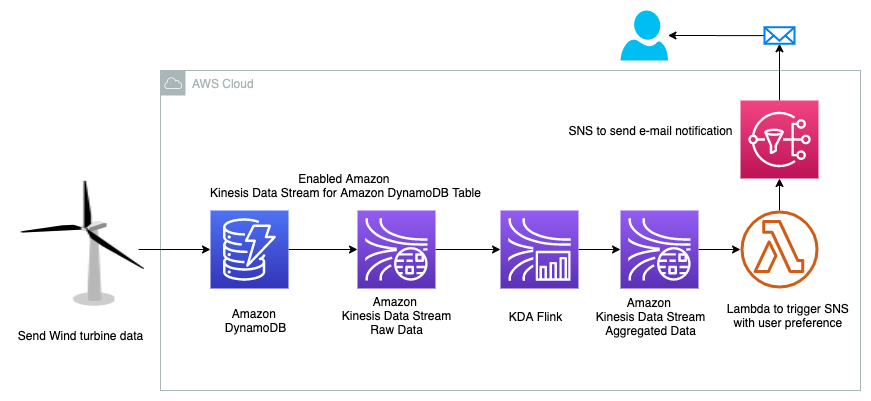

In the architecture, you have high-velocity wind speed data coming from
the wind turbine and stored in DynamoDB. To send an instant
notification, you need to query the data in real time and send a
notification when the wind speed is beyond the required limit. To
achieve this goal, you enable Kinesis Data Streams for DynamoDB, then
use KDA Flink to query real-time data in a 60-second tumbling window.
This aggregated data is stored in another data stream, which triggers an
email notification via Amazon SNS using Lambda when the wind speed more
than 60 mph. You can build this entire data pipeline in a serverless
manner.

Deploying the wind turbine data simulator 
-----------------------------------------

To replicate a real-life scenario, you need a wind turbine data
simulator. We use Amazon Amplify to deploy a user-friendly web
application that can generate the required data and store it in
DynamoDB. You need to have a H[Gitub account](https://github.com/) to
fork the Amplify app code and deploy it in your AWS account. Complete
the following steps to deploy the data simulator web app:

1.  Choose the following AWS Amplify link to launch the wind turbine
    data simulator web app: **To Do: move code to AWS samples repo**

2.  Choose **Connect to** **GitHub** and provide credentials if needed.

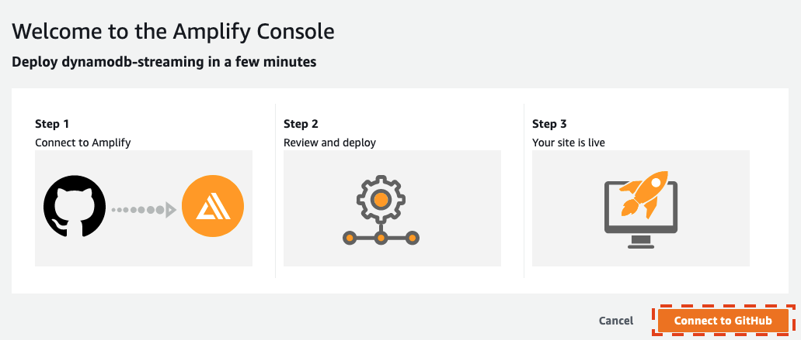

3.  In the **Deploy App** section, under **Select service role**, choose
    **Create new role.**

4.  Follow the instructions to create the role
    amplifyconsole-backend-role.

5.  When the role is created, choose it from the drop-down menu.

6.  Choose **Save and deploy**.

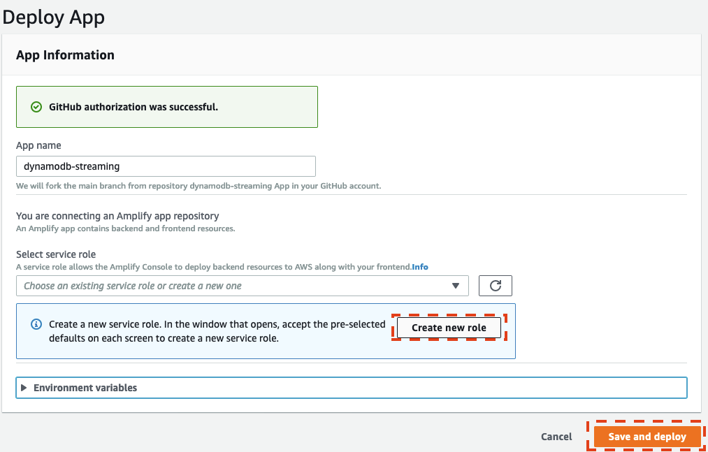

On the next page, you see that the app dynamodb-streaming is ready to
deploy.

7.  Choose **Continue**.

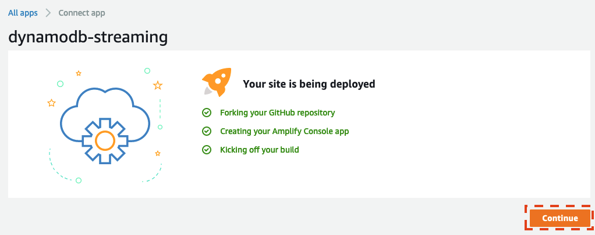

On the next page, you can see the app build and deploy progress, which
may take up to 10 minutes to complete.

8.  When the process is complete, choose the URL on the left to access
    the data generator UI.  

9.  Make sure to save this URL to use in later steps.

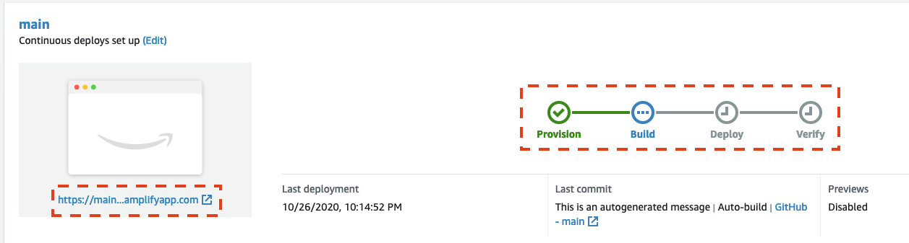

You also get an email during the build process related to your SSH key.
This email indicates that the build process created an SSH key on your
behalf to connect to the Amplify application with GitHub.

10.  On the login page, choose **Create account**.

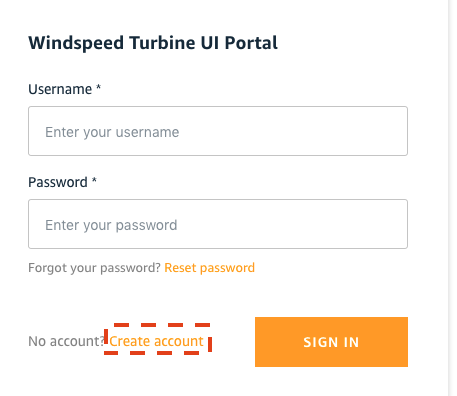

11.  Provide a user name, password, and valid email where the app can
    send you a one-time passcode to access the UI.

12.  After you log in, choose **Generate Data** to generate wind speed
    data.

13.  Choose the **Refresh** icon to show the data in the graph.

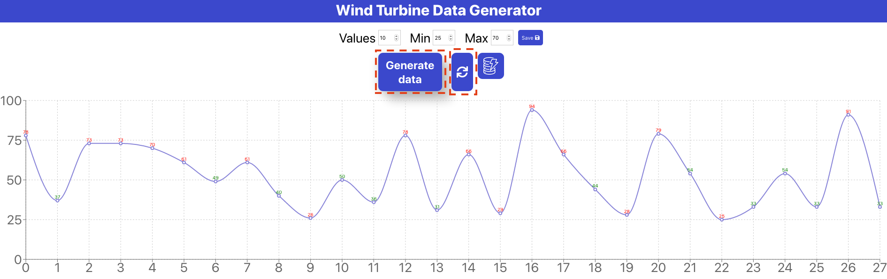

You can generate a variety of data by changing the range of minimum and
maximum speeds and number of values.

To see the data in DynamoDB, choose the DynamoDB icon, note the table
name that starts with windspeed-, and navigate to that table on the
DynamoDB console.

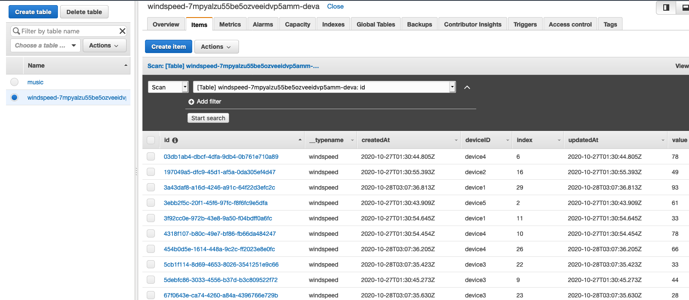

Now that the wind speed data simulator is ready, let’s deploy the rest
of the data pipeline.

Deploying the automated data pipeline using AWS CloudFormation
--------------------------------------------------------------

You use AWS CloudFormation
[templates](https://aws.amazon.com/cloudformation/aws-cloudformation-templates/)
to create all the necessary resources. This removes opportunities for
manual error, increases efficiency, and ensures consistent
configurations over time. You can view template in the GitHub
repository.

1.  Choose **Launch with CloudFormation Console**:

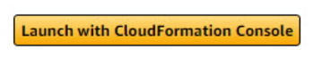

template.yml to be hosted in blog bucket during final staging. Further,
hyperlink to be changed on the ‘Launch with CloudFormation Console’
(https://console.aws.amazon.com/cloudformation/home?region=us-west-2\#/stacks/create/template?stackName=kds-ddb-blog&templateURL=**https://s3-us-west-2.amazonaws.com/bucket.aws/ddbstreaming-blog/template.yaml)**

2.  Choose the US West (Oregon) Region (us-west-2).

3.  For **pEmail**, enter a valid email that the analytics pipeline can
    send notifications to.

4.  Choose **Next**.

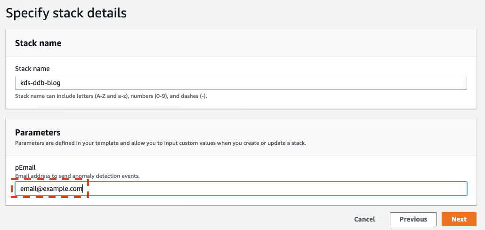

5.  Acknowledge that the template may create AWS Identity and Access
    Management (IAM) resources.

6.  Choose **Create stack**.

This CloudFormation template creates the following resources in your AWS
account:

-   An IAM role to provide a trust relationship between Kinesis and
    DynamoDB to replicate data from DynamoDB to the data stream

-   Two data streams:

    -   An input stream to replicate data from DynamoDB

    -   An output stream to store aggregated data from the KDA Flink app

-   A Lambda function

-   An SNS topic to send an email notification of high wind speeds  

7.  When the stack is ready, on the **Outputs** tab, note the values of
    both data streams.

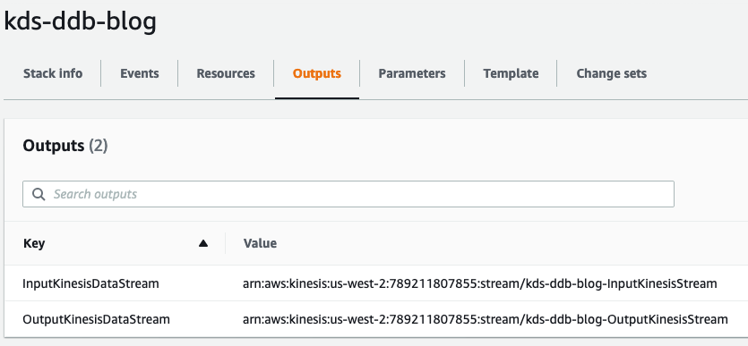

Check your email and confirm your subscription to receive notifications.

Make sure check your junk folder if you don’t see the email in your
inbox.

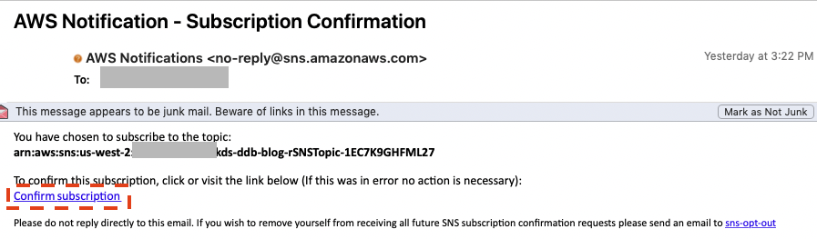

We can now use the Kinesis streaming for DynamoDB feature, which enables
you to have your data in both DynamoDB and Kinesis without having to use
Lambda or write custom code.

Please follow the complete [blog](https://aws.amazon.com/blogs/big-data/building-a-real-time-notification-system-with-amazon-kinesis-data-streams-for-amazon-dynamodb-and-amazon-kinesis-data-analytics-for-apache-flink/)